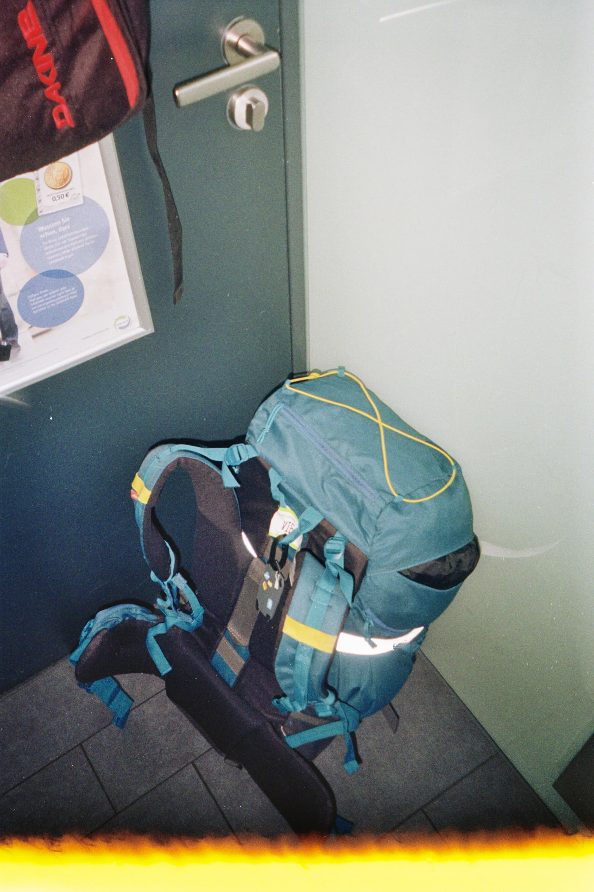
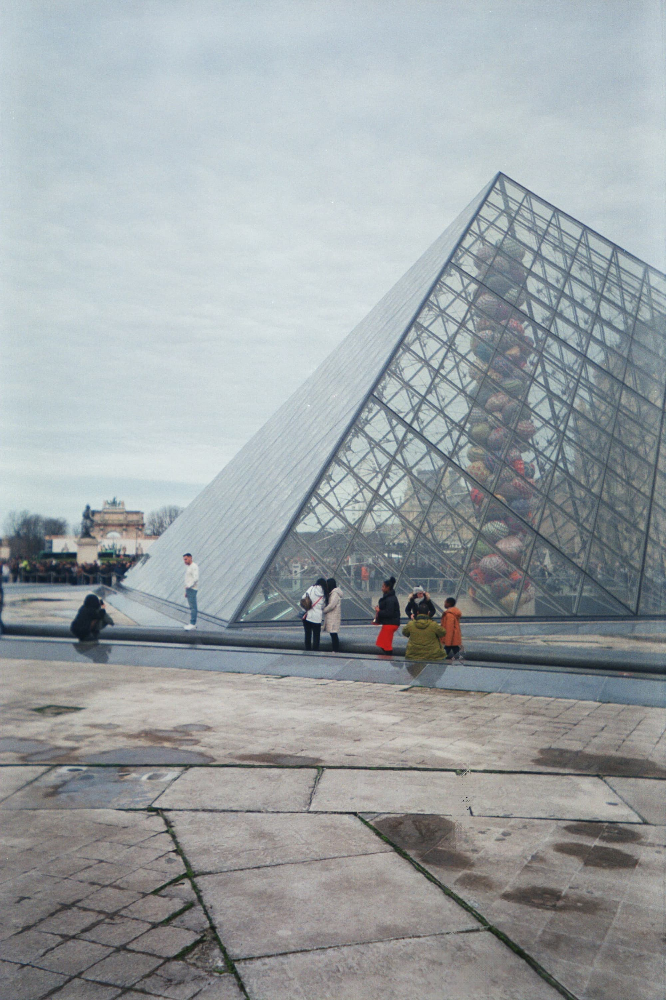
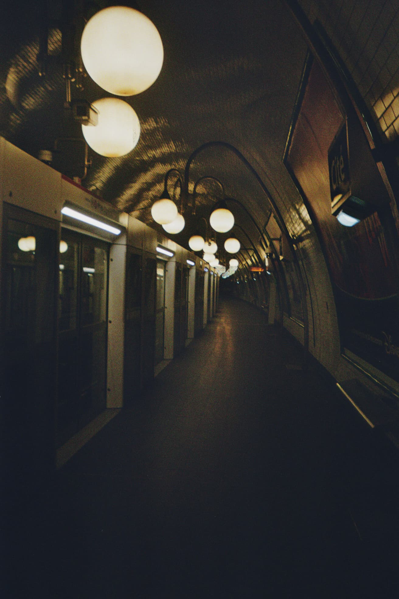
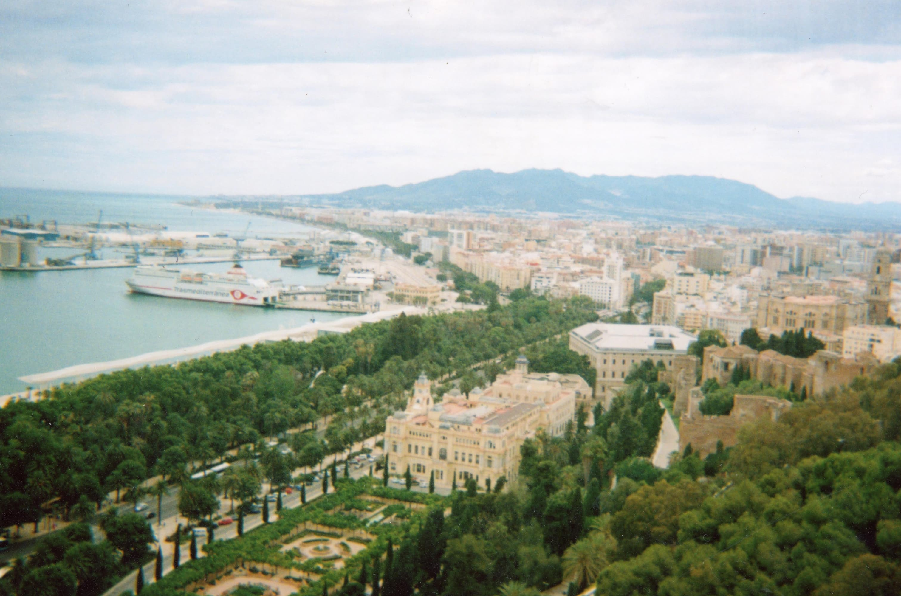
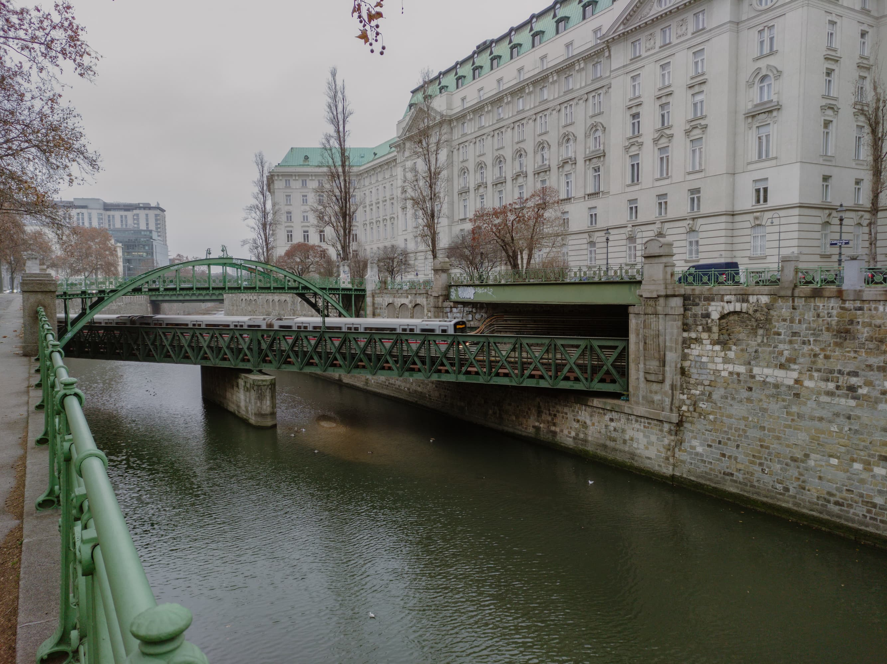
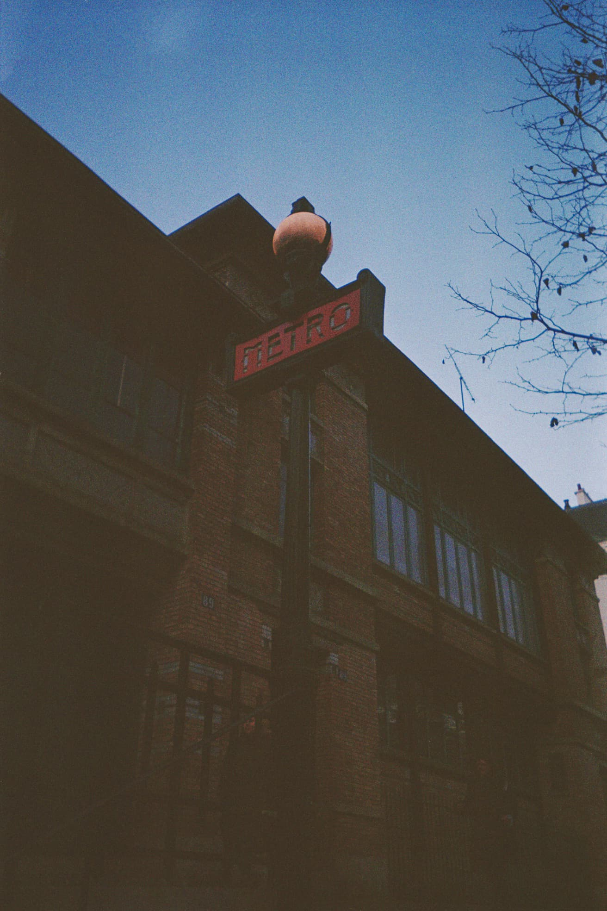

# Terminal Webpage

Simple terminal-themed landing page with randomized backgrounds and a draggable terminal window.

### The Project Uses:

- [Vite.js ](vitejs.dev/ "Vite.js Webpage")
- [React](https://reactjs.org/ "ReactJS Website")
- [Tailwind CSS](tailwindcss.com/ "Tailwind Css Webpage")
- [react-draggable](https://www.npmjs.com/package/react-draggable "react-draggable on NPM")

As well as pictures by me for the backgrounds:

|     |     |    |
| --- | --- | ---|
|  Photo of a backpack, 35mm film. [CC BY-NC-SA 2.0](https://creativecommons.org/licenses/by-nc-sa/2.0/)[View Original Image on Flickr](https://flic.kr/p/2ocHqZf "Image on Flickr") |  One of the louvre museum pyramids, 35mm film [CC BY-NC-SA 2.0](https://creativecommons.org/licenses/by-nc-sa/2.0/)  [View Original Image on Flickr](https://flic.kr/p/2ocHt6e) |   A tunnel in the Paris Métro, 35mm film [CC BY-NC-SA 2.0](https://creativecommons.org/licenses/by-nc-sa/2.0/) [View Original Image on Flickr](https://flic.kr/p/2ocG8Uc) |
|  The Málaga landscape, 35mm film [CC BY-NC-SA 2.0](https://creativecommons.org/licenses/by-nc-sa/2.0/) [View Original Image on Flickr](https://flic.kr/p/2onh3J5) |  Vienna Metro train on a bridge over a river, digital [CC BY-NC-SA 2.0](https://creativecommons.org/licenses/by-nc-sa/2.0/) [View Original Image on Flickr](https://flic.kr/p/2o6Krx4) |  A sign of the Paris Métro, 35mm film [CC BY-NC-SA 2.0](https://creativecommons.org/licenses/by-nc-sa/2.0/) [View Original Image on Flickr](https://flic.kr/p/2ocJo1i)      |
